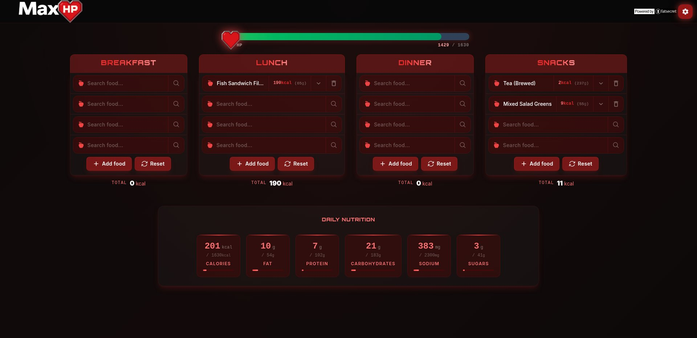
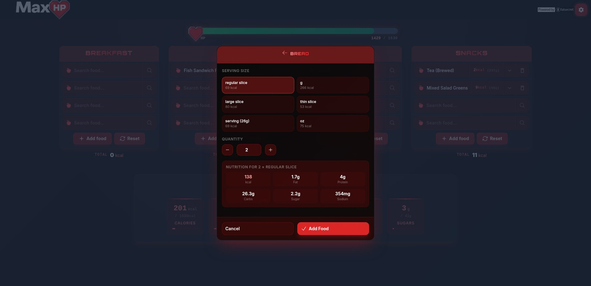
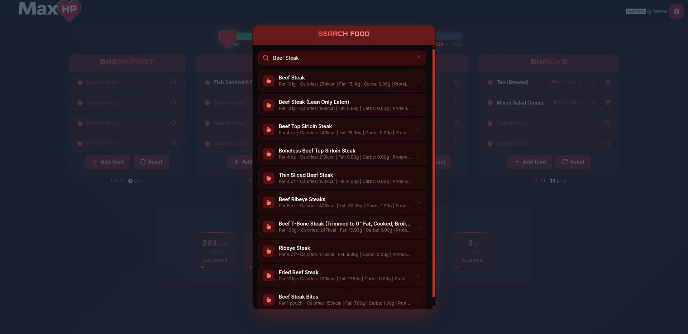

# MaxHP — Level Up Your Health


A gamified calorie tracker that turns your nutrition into an RPG health bar. Built with Nuxt 4 and powered by the FatSecret API.

## Features

- **Per-meal food logging** — Track Breakfast, Lunch, Dinner, and Snacks independently
- **FatSecret food search** — Search a vast nutrition database with detailed serving/portion adjustment
- **HP-bar calorie visualization** — See calories as a health bar with color transitions (green → yellow → orange → red)
- **BMR / TDEE calculator** — Set your Basal Metabolic Rate with activity level and deficit/surplus targeting
- **14-day analytics** — Bar/line charts for calories vs. target, weight trend, and macronutrient breakdown
- **Weight tracking** — Log weight daily, view trendline on the chart
- **Custom foods** — Create and save your own food entries
- **Community food database** — Share and discover foods via a community-driven D1-backed CRUD with moderation
- **Date navigation** — View or edit past days; auto-switches to today at midnight

## Tech Stack

| Tool                                                                           | Purpose                                                  |
| ------------------------------------------------------------------------------ | -------------------------------------------------------- |
| [Nuxt 4](https://nuxt.com/)                                                    | SSR / static framework (Nitro preset `cloudflare-pages`) |
| [Nuxt UI v4](https://ui.nuxt.com/)                                             | UI component library, primary color "gaming"             |
| [Tailwind CSS v4](https://tailwindcss.com/)                                    | Utility-first CSS with custom `@theme` tokens            |
| [Vue 3](https://vuejs.org/)                                                    | UI framework (`<script setup lang="ts">`)                |
| [TypeScript](https://www.typescriptlang.org/)                                  | Strict mode throughout                                   |
| [Chart.js](https://www.chartjs.org/) + [vue-chartjs](https://vue-chartjs.org/) | Analytics charts                                         |
| [FatSecret API](https://platform.fatsecret.com/)                               | Food search and nutrition data (OAuth1 + OAuth2)         |
| [Cloudflare D1](https://developers.cloudflare.com/d1/)                         | Community food database                                  |

## Preview





## Getting Started

### Prerequisites

- Node.js v18+
- pnpm

### Installation

1. Clone the repository:

   ```bash
   git clone https://github.com/Stormesh/simple-calorie-tracker.git
   cd simple-calorie-tracker
   ```

2. Install dependencies (postinstall runs `nuxt prepare`):

   ```bash
   pnpm install
   ```

3. Create a `.env` file in the project root with your FatSecret API credentials:

   ```env
   FATSECRET_API_KEY=your_api_key
   FATSECRET_API_SECRET=your_api_secret
   FATSECRET_API_CLIENT_SECRET=your_oauth2_client_secret
   ```

   > Register at [FatSecret Platform](https://platform.fatsecret.com/) to obtain credentials. OAuth2 is preferred; OAuth1 falls back automatically.

### Development

```bash
pnpm run dev
```

Open [http://localhost:3000](http://localhost:3000).

### Lint

```bash
pnpm exec eslint .
```

### Build

```bash
pnpm run build      # Server build → .output
pnpm run generate   # Static export → dist
pnpm run preview    # Preview production build
```

## Project Structure

```
app/
  app.vue                — Root: UApp > NuxtLayout > NuxtPage
  app.config.ts          — Nuxt UI theme (primary: gaming)
  pages/index.vue        — Single-page app
  layouts/default.vue    — Background gradient + header + slot
  components/            — 21 auto-imported components
  composables/           — Auto-imported state & logic
    day-logs.ts          — DayLog CRUD, date switching, migration
    bmr-state.ts         — BMR/TDEE form (cookie-backed)
    aggregated-nutrients.ts — Computed totals from meal cookies
    weight-change.ts     — Deficit/surplus computation
    food-state.ts        — Food template defaults, cookie reset
    food-details.ts      — Food detail modal state
    community-foods.ts   — Community food CRUD
    custom-foods.ts      — Custom food CRUD
  utils/
    food-types.ts        — IFoodTemplate interface
    meals.ts             — ["Breakfast", "Lunch", "Dinner", "Snacks"]
  assets/css/app.css     — Tailwind theme, glass/glow/hp-bar utilities
server/
  api/
    nutrition/search/[name].ts  — FatSecret food search
    nutrition/[id].ts           — FatSecret food detail
    community/
      search.get.ts             — Search community foods (D1)
      submit.post.ts            — Submit a community food
      flag.post.ts              — Flag a community food
      flagged.get.ts            — List flagged foods (moderator)
      approve.post.ts           — Approve a flagged submission
      delete.post.ts            — Delete a community food
  utils/
    db.ts                — D1 database access
    fatsecret-auth.ts    — OAuth1/OAuth2 helpers
    fatsecret-oauth1.ts
    fatsecret-oauth2.ts
    food-cache.ts        — Per-request in-memory cache
    rate-limit.ts        — API rate limiting
    blocklist.ts         — Content moderation blocklist
```

### State Storage

| Store          | Type              | Key                                        |
| -------------- | ----------------- | ------------------------------------------ |
| Day logs       | `useLocalStorage` | `maxhp-day-log:all`                        |
| Meal foods     | `useCookie`       | `foods-{Breakfast\|Lunch\|Dinner\|Snacks}` |
| Current date   | `useCookie`       | `current-date`                             |
| BMR form       | `useCookie`       | `bmr`                                      |
| Migration flag | `useLocalStorage` | `maxhp-format-v2`                          |

### Configuration

- **Calorie target** — Set in the Diet Profile modal (BMR + activity level + deficit/surplus)
- **Unit system** — Metric (kg/cm) or Imperial (lbs/in) in Diet Profile
- **Custom foods** — Add via the "Custom Food" button in any meal section
- **Search provider** — FatSecret; falls back from OAuth2 to OAuth1

## Deployment

This app is designed for [Cloudflare Pages](https://pages.cloudflare.com/).

```bash
pnpm run build
npx wrangler deploy
```

Requires a Cloudflare D1 database named `maxhp-community` (configured in `wrangler.toml`).

### Environment Variables

| Variable                      | Required | Description                      |
| ----------------------------- | -------- | -------------------------------- |
| `FATSECRET_API_KEY`           | Yes      | FatSecret consumer key           |
| `FATSECRET_API_SECRET`        | Yes      | FatSecret consumer secret        |
| `FATSECRET_API_CLIENT_SECRET` | No       | FatSecret OAuth2 client secret   |
| `NUXT_MODERATOR_SECRET`       | No       | Community food moderation secret |

---

Powered by [FatSecret](https://platform.fatsecret.com/)
